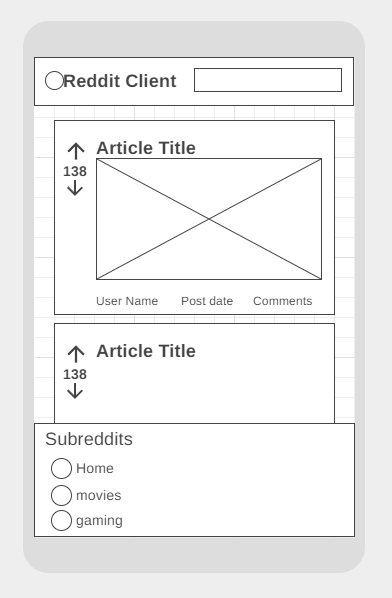
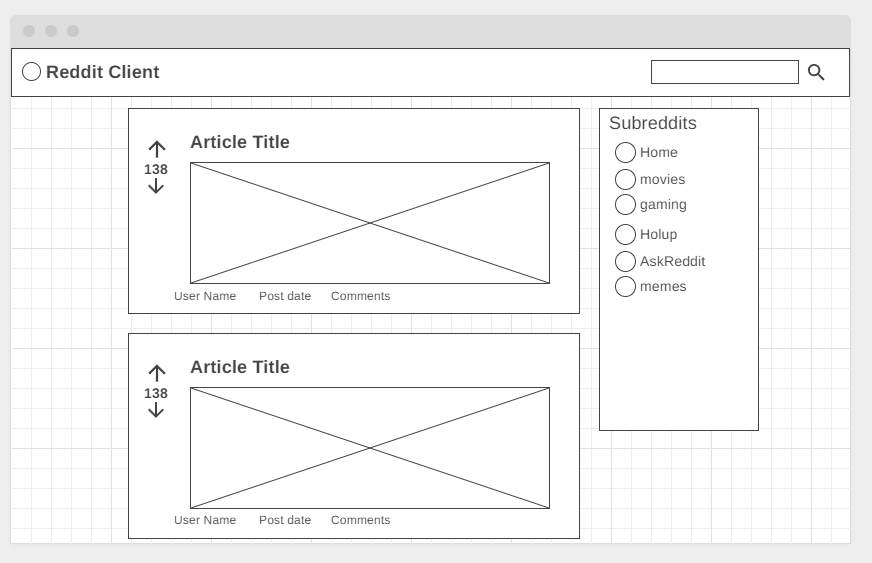
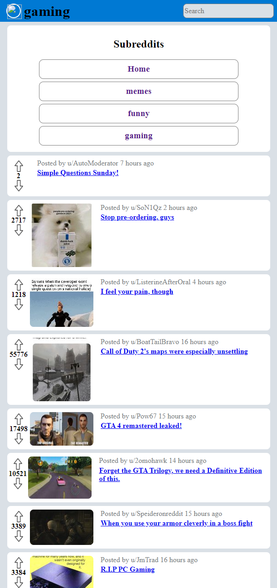
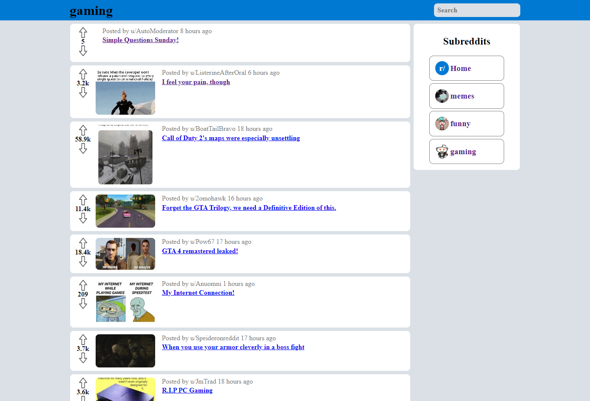

# Full Stack Engineer - Reddit Client
### CodeCademy | Full Stack Engineer
insert into working `React-Redux` environment to run 
`npx create-react-app reddit-app --template redux`

## Description
For this project, we will be using the [Reddit JSON API](https://github.com/reddit-archive/reddit/wiki/JSON). There is no maintained documentation but the API is simple enough to use. We will provide you with some pointers on how to use it.

Note that Reddit has 2 APIs: the [official API](https://www.reddit.com/dev/api/) and an [undocumented JSON API](https://github.com/reddit-archive/reddit/wiki/JSON). You are welcome to use either APIs but we recommend using the JSON API because it doesn’t require an OAuth workflow. Using the JSON API does have limitations such as no write operations. For the purposes of this project, we find the JSON API adequate.

You can take any Reddit URL, add .json at the end of it, and get JSON. For example, if you want to get the Popular page data in JSON:
* Original URL: `https://www.reddit.com/r/popular/`
* JSON URL: `https://www.reddit.com/r/popular.json`

If you want to search for “cake recipes”:
* Original URL: `https://www.reddit.com/search?q=cake%20recipes`
* JSON URL: `https://www.reddit.com/search.json?q=cake%20recipes`

Notice here you didn’t add `.json` at the end of the URL. You actually added it before the start of the query string. Refer to [this article](https://www.quora.com/What-are-the-parts-of-a-URL) for a breakdown of the structure of a URL.

The Reddit API will return some user content (comments) in Markdown. You should find a way to display the Markdown in your application.

## Project Requirements
- [x] Build the application using React and Redux
- [x] Version control your application with Git and host the repository on GitHub
- [x] Use a project management tool (GitHub Projects, Trello, etc.) to plan your work
- [x] Write a README (using Markdown) that documents your project including:
  - [x] Wireframes
  - [x] Technologies used
  - [ ] Features
  - [ ] Future work
- [ ] Write unit tests for your components using Jest and Enzyme
- [ ] Write end-to-end tests for your application
- [x] Users can use the application on any device (desktop to mobile)
- [x] Users can use the application on any modern browser
- [ ] Users can access your application at a URL
- [x] Users see an initial view of the data when first visiting the app
- [x] Users can search the data using terms
- [x] Users can filter the data based on categories that are predefined
- [x] Users are shown a detail view (modal or new page/route) when they select an item
- [ ] Users are delighted with a cohesive design system
- [ ] Users are delighted with animations and transitions
- [ ] Users are able to leave an error state
- [ ] Get 90+ scores on [Lighthouse](https://web.dev/measure/)
  - [ ] We understand you cannot control how media assets like videos and images are sent to the client. It is okay to have a score below 90 for Performance if they are related to the media from Reddit.
- [ ] OPTIONAL: [Get a custom domain name and use it for your application](https://www.codecademy.com/courses/make-a-website/lessons/setting-up-your-domain/exercises/how-websites-work)
- [ ] OPTIONAL: Set up a CI/CD workflow to automatically deploy your application when the master branch in the repository changes
- [ ] OPTIONAL: Make your application a progressive web app

## Prerequisites
- [x] HTML
- [x] CSS
- [x] JavaScript
- [x] React
- [x] Redux
- [ ] Jest, Enzyme, and Selenium
- [x] Git and GitHub
- [x] Command line and file navigation
- [x] Wireframing

Check out these helpful resources:
* [Thinking About Errors in Your Code Differently](https://www.codecademy.com/content-items/673d70052fe5627f2222ab7840b4c5db)
* [Intro to Chrome Devtools](https://www.codecademy.com/content-items/8e57b181e3c4a62b70476bd76ab11624)
* [CSS Visual Rules in Chrome Inspector](https://www.codecademy.com/content-items/73ce848773660b8f73086a073113c3fe)
* [Documentation and Research](https://www.codecademy.com/content-items/8219be05381030feb2d9530fedb457fd)
* [Debugging JavaScript Code](https://www.codecademy.com/content-items/e8a7f4f36eae1c4ee642af3cea4bfb4a)
* [React Developer Tools](https://www.codecademy.com/paths/build-web-apps-with-react/tracks/bwa-intro-to-react/modules/ravenous-part-one/informationals/ready-react-developer-tools)
* [Redux DevTools Extension](https://www.codecademy.com/content-items/698c535e3cdf6ce8484bd34138341767)

## Mobile - Wireframe & Capture

## PC - Wireframe & Capture

## PC - Working Progress

## Example Code
Want to see an example of how someone else has completed this project? Click this [link to download a zip file containing one example solution to this project](https://static-assets.codecademy.com/Paths/front-end-career-path/reddit-client/reddit-client-master.zip). Remember: your project doesn’t have to look anything like this! It should be unique to your vision.

## Debugging Tips + Helpful Resources
Feeling stuck? Try the following:
* <i>Google your question</i>: oftentimes, someone has had the same question as you! Check out websites like <i>StackOverflow</i> and <i>Quora</i> to see how other folks have found solutions.
* <i>Read the documentation</i>: make sure to carefully read through the documentation for any languages and libraries that you are using. Oftentimes they’ll have examples of what you’re looking for!
* <i>Rubber ducking</i>: try to explain a problem to a friend or co-worker. Oftentimes you’ll figure out the solution as you’re trying to explain it. And if not, getting another pair of eyes on your code can be helpful.

## Resources
* netlify.app [Example Project](https://reddit-client.netlify.app/)
* Wikipedia: [Scope creep](https://en.wikipedia.org/wiki/Scope_creep)
* create-react-app.dev: [Create React App](https://create-react-app.dev/)
* redux-toolkit.js.org: [Create React App with Redux Flag](https://redux-toolkit.js.org/introduction/getting-started#using-create-react-app)
* Git: [cheat sheet](https://education.github.com/git-cheat-sheet-education.pdf)
* Codecademy: [Learn Git](https://www.codecademy.com/learn/learn-git)
* Reddit: [Official API](https://www.reddit.com/dev/api/)
* Reddit: [Undocumented JSON API](https://github.com/reddit-archive/reddit/wiki/JSON)
