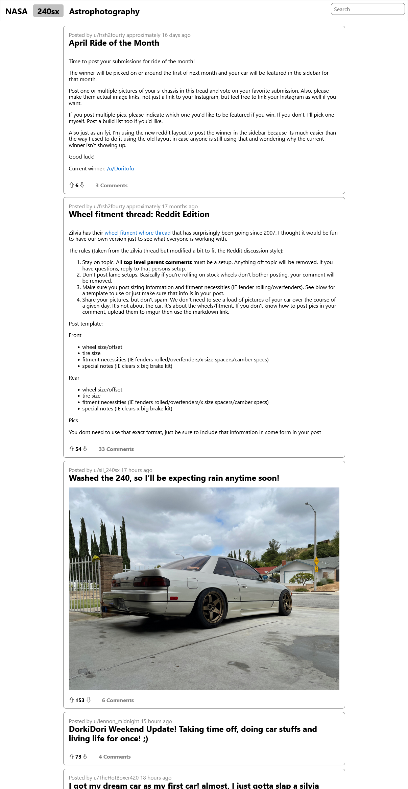

# Reading Reddit API
### [Full-Stack Software Engineer](https://sender6.zohoinsights1.eu/ocgeturl/13ef.4aba358de?l=671e5ce0-de5d-11eb-b191-52540048feb1&m=671cfd50-de5d-11eb-b191-52540048feb1&h=5c84b7e6f71f2ee40328109322b3e7c688b516d02edbc3c608be348e412fa9b4)

## Description
This project is oriented towards front-end development, and main objective is to receive json data, handle it and display it using `React-Redux`. This is not meant to be a copy of the existing reddit platform.

`React-Redux` template enables creation of visual representation of `json data`. `fetch API` acquires data from reddit JSON API every time the app is opened. `Redux` part of equation is responsible for handling internal `app state`, this includes structuring and modelling data, handling updates, and making additional API calls if necessary. `React` enables creation of application like webpage, where instead of whole page load/reloads parts of it are updated as necessary.

Posts are displayed using `react-markdown` npm module, it handles accurate markdown execution and integration into React functional components. To access comments additional API call with post id is required to different endpoint.

### Technologies Used
* JavaScript
* React - modulary create and inject page elements
* Redux - manage page state and enable in-page search
* fetch API - make calls to reddit.com API to receive post and comment data
* Netlify - hosting

## Project Requirements
- [x] Build the application using React and Redux
- [x] Version control your application with Git and host the repository on GitHub
- [x] Use a project management tool (GitHub Projects, Trello, etc.) to plan your work
- [x] Write a README (using Markdown) that documents your project including:
  - [x] Description
  - [x] Technologies used
- [x] Users can use the application on any device (desktop to mobile)
- [x] Users can use the application on any modern browser
- [x] Users can access your application at a URL
- [x] Users can search the data using terms
- [x] Users can filter the data based on categories that are predefined

## Resources
<!-- * netlify.app [Example Project](https://reddit-client.netlify.app/) -->
* Wikipedia: [Scope creep](https://en.wikipedia.org/wiki/Scope_creep)
* create-react-app.dev: [Create React App](https://create-react-app.dev/)
* redux-toolkit.js.org: [Create React App with Redux Flag](https://redux-toolkit.js.org/introduction/getting-started#using-create-react-app)
* Reddit: [Undocumented JSON API](https://github.com/reddit-archive/reddit/wiki/JSON)
